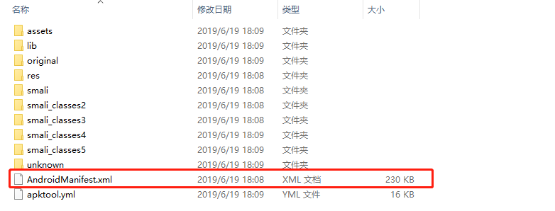

## 获取App 的packageName 和 Activity的方法

**“ 使用appium 编写自动化脚本需要配置App 的packageName和Activity, 下面介绍几种常用获取packageName和Activity的方法。 ”**

### 一、使用Android-SDK 中的aapt工具**(需要配置安卓开发环境)**
~~~
在cmd 中运行aapt dump badging *.apk
~~~

**在cmd中找到[package: name="..."] com.tencten.tim 是app的包名**

 

**在cmd找到[lunchable-activity name='...'] com.tencent.mobileqq.activity.SplashActivity是app的Activity.** 

 

### 二、有的app通过aapt工具找不到Activity(抖音), 可以使用logcat获取
**使用adb连接手机**

~~~ 
1. 在cmd输入 adb devices 命令查看是否已连接手机。我使用的是模拟器，通过 adb connect ip:port 命令连接，连接成功后显示如图内容;
2. 使用真机连接需要开启开发者模式, 开启USB调试, 再使用adb devices命令查看是否连接成功
~~~

**在日志文件中获取Activity**
~~~
1. 成功连接手机后，在cmd中输入 adb logcat > g:/log.log 命令，
2. 在手机随便点几下你要获取的Activity 的App。 
3. 按下CTRL + C 结束adb logcat 命令
4. 在g盘中打开log.log 文件(g:/log.log 可自定义,c盘除外), 
~~~
**搜索"Displayed" "Displayed com.ss.android.ugc.aweme/.main.MainActivity: +2s90ms (total +2s229ms)" 
&emsp;"/" 前面的是包名": com.ss.android.ugc.aweme" 
&emsp;"/" 后面的是Activity: .main.MainActivity**

### 三、通过查看日志的方式获取Activity。类似第二种方法
~~~
1. 使用adb shell 进入手机的系统（需要先执行方法二中的"连接手机")
2. 运行 logcat | grep cmp=
~~~

**"cmp=" 后的内容就是packageName和Activity**

**前面三种方法都需要安装Android-SDK, 使用的工具(adb, aapt)都添加在环境变量中.  
adb.exe /sdk/platform-tools/ 
aapt.exe /sdk/build-tools/28.0.3/**

### 四、使用apktool 反编译App
#### [下载apktool](https://bitbucket.org/iBotPeaches/apktool/downloads/apktool_2.4.0.jar)
~~~
1. 配置java运行环境.
2. 在apktool的目录下,按住shift 点击鼠标右键选择"在此处打开powershell..." 或 cmd cd到apktool目录下.
3. 输入命令apktool d *.apk 或 java -jar apktool d *.apk
~~~

> 执行apktool d *.apk 反编译App

>  反编译后生成如下文件，选择 AndroidManifest.xml

> 全局搜索 `android.intent.action.MAIN` 或 `android.intent.category.LAUNCHER`,在activity 或 activity-alias 标签中android:name 的值就是app 的Activity。

